# Retail Broking and Investment Data Platform

## Contents

- [Retail Broking and Investment Data Platform](#retail-broking-and-investment-data-platform)
  - [Contents](#contents)
  - [Introduction](#introduction)
  - [Architecture Diagram](#architecture-diagram)
  - [Architecture Decisions \& Rationale](#architecture-decisions--rationale)
    - [Sources](#sources)
    - [Trade-offs](#trade-offs)
      - [PostgreSQL](#postgresql)
    - [Kafka](#kafka)
      - [Topics](#topics)
      - [Configuration](#configuration)
      - [Trade-offs](#trade-offs-1)
    - [Flink Processing](#flink-processing)
      - [Jobs](#jobs)
      - [Trade-offs](#trade-offs-2)
    - [Kafka Connect — Iceberg Sink](#kafka-connect--iceberg-sink)
      - [What lands in Bronze](#what-lands-in-bronze)
      - [Trade-offs](#trade-offs-3)
    - [Iceberg Medallion Architecture](#iceberg-medallion-architecture)
      - [Bronze — Raw Ingest](#bronze--raw-ingest)
      - [Silver — Cleaned \& Typed](#silver--cleaned--typed)
      - [Gold — Business Aggregates](#gold--business-aggregates)
      - [Iceberg Features in Use](#iceberg-features-in-use)
      - [Trade-offs — Why Iceberg over Delta Lake and Hudi](#trade-offs--why-iceberg-over-delta-lake-and-hudi)
    - [ClickHouse — Real-time Analytical Read Model](#clickhouse--real-time-analytical-read-model)
      - [Two Write Paths](#two-write-paths)
      - [Table Engines](#table-engines)
      - [Trade-offs](#trade-offs-4)
    - [Orchestration — Apache Airflow](#orchestration--apache-airflow)
      - [What Airflow Orchestrates](#what-airflow-orchestrates)
      - [How Spark Jobs Are Orchestrated](#how-spark-jobs-are-orchestrated)
      - [Data-Quality Gating](#data-quality-gating)
      - [Backfill \& Reprocessing](#backfill--reprocessing)
      - [Trade-offs](#trade-offs-5)
    - [Serving Layer](#serving-layer)
      - [Analytics / Query API](#analytics--query-api)
      - [Trino — Federated Query](#trino--federated-query)
      - [Semantic Layer — Cube](#semantic-layer--cube)
      - [Feature Store](#feature-store)
    - [Governance — Apache Polaris \& OpenMetadata](#governance--apache-polaris--openmetadata)
      - [Apache Polaris — Iceberg Catalog \& Access Control](#apache-polaris--iceberg-catalog--access-control)
      - [OpenMetadata — Lineage, PII \& Audit](#openmetadata--lineage-pii--audit)
    - [Alerting \& Observability](#alerting--observability)
      - [Where Signals Are Captured](#where-signals-are-captured)
      - [Metrics — Prometheus](#metrics--prometheus)
      - [Alerting — Slack \& PagerDuty](#alerting--slack--pagerduty)
      - [Trade-offs — Why Prometheus](#trade-offs--why-prometheus)
    - [Consumers](#consumers)
      - [Data API — Curated Data Exposure](#data-api--curated-data-exposure)
      - [MIS Analyst — Scheduled \& Ad-hoc Reporting](#mis-analyst--scheduled--ad-hoc-reporting)
      - [Conversational BI — Natural Language Queries](#conversational-bi--natural-language-queries)
      - [ML Engineers — Feature Pipelines](#ml-engineers--feature-pipelines)

---

## Introduction

The Retail Broking and Investment Data Platform is a real-time, end-to-end data infrastructure designed to ingest, process, and serve financial data from exchange feeds (NSE via FIX/ITCH) and operational systems (KYC, payments, mutual funds) through a unified streaming and lakehouse architecture. It combines Apache Kafka for event streaming, Apache Flink for real-time processing, and an Iceberg medallion lake (Bronze → Silver → Gold) with ClickHouse as the low-latency analytical read model. The platform serves a diverse set of consumers — curated Data APIs, MIS analysts, Conversational BI, and ML feature pipelines — underpinned by Apache Polaris and OpenMetadata for catalog, lineage, PII masking, and audit governance.

---

## Architecture Diagram

```mermaid
%%{init: {
  "theme": "base",
  "flowchart": { "curve": "basis", "nodeSpacing": 45, "rankSpacing": 85, "padding": 12 },
  "themeVariables": {
    "fontFamily": "Inter, Segoe UI, sans-serif",
    "fontSize": "14px",
    "clusterBkg": "#1B1B1F",
    "clusterBorder": "#3A3A42",
    "lineColor": "#7C8AA0",
    "edgeLabelBackground": "#1B1B1F"
  }
}}%%
flowchart LR

  %% ─── SOURCES ─────────────────────────────────────────────
  subgraph SOURCES["Sources"]
    direction TB
    NSE["NSE Exchange"]
    BKSVC["Broking Service<br/><i>application</i>"]
    PG["PostgreSQL<br/>KYC · Payments<br/>MF · Backoffice"]
    BKSVC --> PG
  end

  %% ─── INGESTION ───────────────────────────────────────────
  subgraph INGESTION["Ingestion"]
    direction TB
    EXSVC["Exchange Service<br/>FIX / ITCH"]
    DBZ["Debezium CDC<br/><i>connector per service</i>"]
  end

  %% ─── KAFKA ───────────────────────────────────────────────
  subgraph KAFKA["Kafka"]
    direction TB
    KMD["market-data"]
    KER["execution-reports"]
    KTE["trade-events"]
    KCE["cdc-events"]
  end

  SREG["Schema Registry"]
  KCCONN["Kafka Connect<br/>Iceberg Sink"]

  %% ─── FLINK PROCESSING ───────────────────────────────────
  subgraph PROC["Flink Processing"]
    direction TB
    FJ3["Execution Report<br/>Processing"]
    FJ1["Market Data<br/>Aggregation"]
    FJ2["Trade Event<br/>Processing · CEP"]
  end

  %% ─── STORAGE TIERS ───────────────────────────────────────
  subgraph TIERS["Storage Tiers"]
    direction TB

    subgraph ANAL["Real-time / analytical read model"]
      CH["ClickHouse<br/>OHLCV · NAV<br/>MIS · Analytics"]
    end

    subgraph LAKE["Iceberg Medallion"]
      direction LR
      BRONZE["Bronze<br/><i>raw ingest</i>"]
      SILVER["Silver<br/><i>cleaned / typed</i>"]
      GOLD["Gold<br/><i>business aggregates</i>"]
      BRONZE -->|Spark| SILVER
      SILVER -->|Spark| GOLD
    end
  end

  %% ─── SERVING ─────────────────────────────────────────────
  subgraph SERVING["Serving Layer"]
    direction TB
    CHAPI["Analytics<br/>Query API"]
    TRINO["Trino<br/>Federated query"]
    SEM["Cube<br/>Semantic Layer"]
    FS["Feature Store"]
  end

  %% ─── CONSUMERS ───────────────────────────────────────────
  subgraph CONSUMERS["Consumers"]
    direction TB
    DAPI["Data API<br/>Curated data exposure"]
    MIS["MIS Analyst<br/>Scheduled + adhoc"]
    CONVBI["Conversational BI<br/>NL query + audit"]
    ML["ML Engineers<br/>Feature pipelines"]
  end

  %% ─── CONTROL PLANE (governance + orchestration) ──────────
  subgraph CTRL["Control Plane — spans all layers"]
    direction TB
    CATALOG["Apache Polaris + OpenMetadata<br/>Catalog · Lineage · PII masking · Audit"]
    ORCH["Apache Airflow<br/>Batch orchestration · DAGs · DQ gates · SLAs"]
  end

  %% ─── EDGES: Sources → Ingestion ──────────────────────────
  NSE --> EXSVC
  PG  --> DBZ

  %% ─── EDGES: Ingestion → Kafka ────────────────────────────
  EXSVC --> KMD
  EXSVC -->|execution reports| KER
  BKSVC -->|order lifecycle| KTE
  DBZ   --> KCE

  %% ─── EDGES: Kafka → Stream Processing ────────────────────
  KMD --> FJ1
  KER --> FJ3
  KTE --> FJ2
  KMD --> KCCONN
  KCE --> KCCONN

  %% ─── EDGES: Stream Processing → Storage ──────────────────
  FJ1    -->|real-time| CH
  FJ3    -->|real-time P&L · positions| CH
  FJ3    -->|raw ingest| BRONZE
  FJ2    -->|raw ingest| BRONZE
  KCCONN -->|raw ingest| BRONZE

  %% ─── EDGES: Lake → read model & serving ──────────────────
  GOLD   -.->|Spark| CH
  CH     --> CHAPI
  SILVER --> TRINO
  GOLD   --> TRINO
  GOLD   --> SEM
  GOLD   --> FS

  %% ─── EDGES: Serving → Consumers ──────────────────────────
  CHAPI --> DAPI
  CHAPI --> MIS
  TRINO --> MIS
  SEM   --> CONVBI
  FS    --> ML

  %% ─── CONTROL-PLANE (non-data) edges ──────────────────────
  %% Kept deliberately sparse: each control-plane node anchors to the
  %% lakehouse it governs, so the dashed edges no longer cross the
  %% data flow. The node labels carry the full cross-cutting scope.
  SREG    -.- KAFKA
  CATALOG -.- LAKE
  ORCH    -.- LAKE

  %% ─── STYLES ──────────────────────────────────────────────
  classDef source     fill:#D7D5CB,stroke:#6B6A65,color:#2C2C2A,stroke-width:1px
  classDef ingest     fill:#9FE1CB,stroke:#0F6E56,color:#04342C,stroke-width:1px
  classDef schema     fill:#FFE5A0,stroke:#B8860B,color:#4A3800,stroke-width:1px
  classDef kafka      fill:#AFA9EC,stroke:#534AB7,color:#26215C,stroke-width:1px
  classDef proc       fill:#C9A9F0,stroke:#7A3FBF,color:#2E1456,stroke-width:1px
  classDef lake       fill:#B5D4F4,stroke:#185FA5,color:#042C53,stroke-width:1px
  classDef analytical fill:#C0DD97,stroke:#3B6D11,color:#173404,stroke-width:1px
  classDef serving    fill:#F5C4B3,stroke:#993C1D,color:#4A1B0C,stroke-width:1px
  classDef consumer   fill:#D7D5CB,stroke:#6B6A65,color:#2C2C2A,stroke-width:1px
  classDef govern     fill:#FFE5A0,stroke:#B8860B,color:#4A3800,stroke-width:1px
  classDef orch       fill:#FFD0A6,stroke:#B86B0B,color:#4A2E00,stroke-width:1px

  class NSE,BKSVC,PG source
  class EXSVC,DBZ ingest
  class SREG schema
  class CATALOG govern
  class ORCH orch
  class KMD,KTE,KER,KCE kafka
  class KCCONN kafka
  class FJ1,FJ2,FJ3 proc
  class BRONZE,SILVER,GOLD lake
  class CH,CHAPI analytical
  class TRINO,SEM,FS serving
  class DAPI,MIS,CONVBI,ML consumer

  %% subtle subgraph title styling
  style SOURCES   fill:#16161A,stroke:#3A3A42
  style INGESTION fill:#16161A,stroke:#3A3A42
  style KAFKA     fill:#16161A,stroke:#3A3A42
  style PROC      fill:#16161A,stroke:#3A3A42
  style TIERS     fill:#141418,stroke:#3A3A42
  style LAKE      fill:#16161A,stroke:#2F4A66
  style ANAL      fill:#16161A,stroke:#3B6D11
  style SERVING   fill:#16161A,stroke:#3A3A42
  style CONSUMERS fill:#16161A,stroke:#3A3A42
  style CTRL      fill:#16161A,stroke:#3A3A42
```



---

## Architecture Decisions & Rationale

### Sources

The platform draws from three primary source systems:

- **NSE Exchange** — the upstream market data feed, delivering real-time tick data (prices, volumes, order book updates) over FIX and ITCH protocols.
- **Broking Service** — the core application that manages the order lifecycle, emitting trade events directly to Kafka as orders progress through states (placed → executed → settled).
- **PostgreSQL** — the operational store backing KYC, payments, mutual funds, and back-office workflows. Each domain is an independent service with its own PostgreSQL instance — not a single shared database — so load, scaling, and failure are isolated per domain. Changes are captured via Debezium CDC rather than direct queries, keeping the source databases free from analytical load.

### Trade-offs

#### PostgreSQL

The key reason PostgreSQL is the right choice is its first-class support for Debezium CDC. Debezium captures changes via PostgreSQL's Write-Ahead Log (WAL) using logical replication, exposing `pgoutput` as a native logical decoding plugin — meaning CDC is low-impact, reliable, and requires no polling or triggers. This is the tightest Debezium integration available among relational databases.

**Per-service deployment, not a monolith:** each domain (KYC, Payments, Mutual Funds, Backoffice) runs its own PostgreSQL instance, and CDC is deployed **one Debezium connector per database** rather than a single connector draining a shared store. This avoids one ingestion bottleneck on a single WAL/replication slot, lets each domain scale independently, and contains blast radius — a connector failure, schema change, or replication-slot lag in one domain does not stall the others.

**Why not alternatives:**

| Database | Why it falls short here |
|---|---|
| MySQL | Binlog-based CDC is less expressive; weaker schema enforcement and constraint model |
| Oracle / SQL Server | Licensing cost, vendor lock-in, heavier operationally |

**What makes PostgreSQL a natural fit for the workloads:**

- **KYC & Payments** — ACID transactions with serializable isolation are non-negotiable for financial correctness.
- **Backoffice / MF** — Complex joins across entities (accounts, instruments, settlements) are where PostgreSQL's query planner shines.

---

### Kafka

#### Topics

- **`market-data`** — Real-time tick data (prices, volumes, order book updates) ingested from NSE via the Exchange Service over FIX/ITCH.
- **`trade-events`** — Order lifecycle events emitted by the Broking Service as orders transition through placed → executed → settled states.
- **`execution-reports`** — Trade execution confirmations received directly from the exchange, used for real-time P&L and position updates in ClickHouse.
- **`cdc-events`** — Row-level change events from the per-domain PostgreSQL instances, each captured by its own Debezium connector and published to per-domain topics (e.g. `cdc-events.kyc`, `cdc-events.payments`), then routed to Kafka Connect for Iceberg sink into the Bronze layer.

#### Configuration

**Replication & durability**

These strong-durability settings apply to the financially critical topics — `trade-events` and `execution-reports`:

```properties
# trade-events, execution-reports
replication.factor=3
min.insync.replicas=2
unclean.leader.election.enable=false
```

`min.insync.replicas=2` means a produce request is only acknowledged once at least 2 of the 3 replicas have written the message. `unclean.leader.election.enable=false` prevents an out-of-sync replica from becoming leader, avoiding silent data loss on `trade-events` and `execution-reports`. `market-data` is reproducible reference data from the exchange and runs with lighter durability settings rather than these stricter guarantees.

**Producer** (for `trade-events` / `execution-reports`)

```properties
acks=all                   # wait for all in-sync replicas
enable.idempotence=true    # exactly-once delivery at the producer level
compression.type=lz4       # low-latency compression; snappy is an alternative
```

The `market-data` producer favours throughput over strict guarantees (e.g. `acks=1`), since ticks are reproducible from the exchange feed.

**Dead-letter queues**

Each consumer path (the Flink jobs and the Kafka Connect Iceberg sink) is backed by a dead-letter topic: messages that repeatedly fail deserialization or processing (poison messages) are routed to a `*.dlq` topic instead of blocking the partition, where they can be inspected and replayed once the underlying issue is fixed.

#### Trade-offs

Kafka is the right choice for this platform, primarily because the entire pipeline — Debezium CDC, Flink stream processing, and Kafka Connect Iceberg sink — is built around the Kafka ecosystem.

**Why Kafka specifically:**

- **Durable log with replay** — Kafka retains messages for a configurable period. If a Flink job crashes, it resumes from its last committed offset and reprocesses. RabbitMQ deletes messages on acknowledgement — replay is impossible.
- **Independent consumers** — Flink jobs, Kafka Connect, and any future consumer each maintain their own offset against the same topic. No coordination needed between consumers.
- **Ordering per partition** — Flink's CEP on `trade-events` requires that all events for a given account arrive in order. Kafka guarantees ordering within a partition, which is why partitioning by `account_id` matters.
- **Exactly-once semantics** — With `enable.idempotence=true` on producers and Flink's two-phase-commit Kafka source/sink, exactly-once is achievable along the Kafka-to-Kafka and Kafka-to-Iceberg paths.
- **Throughput** — Market data feeds during peak trading hours produce extremely high message rates across thousands of instruments. Kafka is purpose-built for this scale; alternatives like RabbitMQ are not.

**Comparison with alternatives:**

| Technology | Strengths | Why it falls short here |
|---|---|---|
| **Apache Pulsar** | Built-in multi-tenancy, native tiered storage to S3, separate compute and storage | Operationally heavier (BookKeeper + broker + ZooKeeper); Debezium and Flink ecosystem integration is significantly less mature than Kafka |
| **RabbitMQ** | Simple to operate, very low latency for task queues | Not a log — messages deleted on acknowledgement, no replay, no consumer offset management, no Debezium integration, does not scale to market data volumes |
| **AWS Kinesis** | Fully managed, zero operational overhead, native AWS integration | Hard 7-day retention limit, shard model is less flexible than partitions, no Kafka Connect ecosystem, Debezium does not support it natively, vendor lock-in |

---

### Flink Processing

#### Jobs

- **Market Data Aggregation (FJ1)** — Consumes `market-data`, computes OHLCV candles across configurable time windows (1min, 5min, 1hr), and writes real-time aggregates to ClickHouse and raw ticks to Bronze.
- **Trade Event Processing / CEP (FJ2)** — Consumes `trade-events`, applies Complex Event Processing to detect order lifecycle patterns (placed → executed → settled) and emit enriched events to Bronze.
- **Execution Report Processing (FJ3)** — Consumes `execution-reports`, computes real-time P&L and open positions per account, and writes to ClickHouse for live dashboard consumption.

#### Trade-offs

Flink is the right choice for this platform because it is the only stream processor that satisfies all three requirements simultaneously: true sub-second streaming latency, native CEP for pattern matching (order lifecycle and real-time fraud/anomaly detection), and exactly-once delivery into the Bronze (Iceberg) layer.

**Why Flink specifically:**

- **True streaming** — Flink processes events one at a time with sub-100ms latency. This is non-negotiable for real-time P&L (FJ3), live OHLCV candle updates (FJ1) that feed trader-facing dashboards, and real-time fraud detection where a delay of seconds is too late to act on a suspect order.
- **CEP library** — Flink ships a first-class Complex Event Processing library for matching patterns across ordered event sequences. FJ2 relies on this both to track order lifecycle transitions and to power real-time fraud detection (suspicious order patterns) — a case where truly real-time processing is required, not micro-batch. No equivalent exists in Spark Streaming or Kafka Streams.
- **Event-time watermarking** — Flink's watermark model is the most mature across all stream processors, with fine-grained control per operator. Combined with `CreateTime` from Kafka, it correctly handles out-of-order market data and late trade events without dropping them silently.
- **Large stateful processing** — RocksDB state backend allows FJ1 to maintain aggregation state across thousands of instruments without heap pressure, spilling to local disk transparently.
- **Exactly-once into the lake** — Flink's two-phase-commit Kafka source + Iceberg sink gives true exactly-once delivery into Bronze.

**Comparison with alternatives:**

| Technology | Strengths | Why it falls short here |
|---|---|---|
| **Spark Structured Streaming** | Unified batch + streaming API, large ecosystem, widely known | Micro-batch by default — latency is seconds, not milliseconds; no CEP library; exactly-once end-to-end is harder to achieve; poor fit for FJ1/FJ3 latency requirements and for real-time fraud detection, where micro-batch lag means alerts fire too late to block a suspect order |
| **Kafka Streams** | No separate cluster — runs inside the application, simple to operate | Library-level only, no distributed cluster, no CEP, limited support for complex multi-stream stateful joins at scale, no native ClickHouse sink |

---

### Kafka Connect — Iceberg Sink

Kafka Connect is used for one specific job in this architecture: consuming `cdc-events` from Debezium and writing them as-is into the Bronze layer of the Iceberg medallion lake. No transformation, no enrichment — reliable delivery of raw change events.

#### What lands in Bronze

Each Debezium record carries the full change envelope:

| Field | Description |
|---|---|
| `op` | Operation type: `c` (create), `u` (update), `d` (delete), `r` (read/snapshot) |
| `before` | Row state before the change (null for inserts) |
| `after` | Row state after the change (null for deletes) |
| `source` | Metadata: table name, LSN, transaction ID, timestamp from PostgreSQL WAL |
| `ts_ms` | Timestamp of when Debezium captured the event |

Bronze stores these raw envelopes verbatim. Silver Spark jobs later extract `after` images, cast types, and handle deletes — Bronze is never modified.

#### Trade-offs

| Alternative | Why not used here |
|---|---|
| **Custom Flink job** | Operational overkill for a no-transformation copy; adds a Flink cluster dependency for something Kafka Connect handles natively |
| **Spark Structured Streaming** | Micro-batch latency is unnecessary here; Bronze just needs reliable delivery, not real-time |
| **AWS Glue** | Managed and simple, but vendor lock-in; Polaris catalog integration is not native |

---

### Iceberg Medallion Architecture

The lake is structured as three layers — Bronze, Silver, Gold — each with a distinct contract on data quality and transformation. Spark handles all inter-layer transformations. Iceberg is the table format across all three layers, providing ACID transactions, schema evolution, and time travel on top of plain S3.

#### Bronze — Raw Ingest

Bronze is the landing zone. Data arrives here from two paths:

- **Flink (FJ1, FJ2, FJ3)** — raw tick data, trade events, and execution reports written directly from stream processors
- **Kafka Connect** — raw Debezium CDC envelopes from PostgreSQL

**Contract:** append-only, never modified, schema exactly as received. Bronze is the source of truth for replay — if Silver or Gold jobs have a bug, Bronze is reprocessed.

#### Silver — Cleaned & Typed

Spark jobs consume Bronze and produce Silver on a scheduled cadence (every 15 minutes for market data, hourly for CDC-derived tables).

Transformations applied at this layer:

- **Debezium envelope unpacking** — extract `after` image for inserts/updates; emit a tombstone record for deletes (`op = d`) that downstream Gold jobs use for soft-delete handling
- **Type casting** — all fields cast to proper types (timestamps to `TimestampType`, decimals to `DecimalType` with correct precision for price and quantity fields)
- **Deduplication** — idempotent Spark jobs deduplicate on primary key + event timestamp using Iceberg's `MERGE INTO`
- **PII masking** — fields tagged in OpenMetadata (Aadhaar, PAN, bank account numbers) are masked or tokenised before Silver is written; raw values remain in Bronze, accessible only to authorised roles via Polaris policies

#### Gold — Business Aggregates

Spark jobs consume Silver and produce Gold on a scheduled cadence (with intra-day refreshes for time-sensitive tables).

| Gold Table | Source | Description |
|---|---|---|
| `ohlcv_1min`, `ohlcv_5min`, `ohlcv_1d` | Silver market data | OHLCV candles per symbol per window |
| `nav_daily` | Silver MF data | Net Asset Value per scheme per day |
| `trade_summary` | Silver trade events | Aggregated fills, brokerage, and charges per account per day |
| `settlement_status` | Silver CDC (backoffice) | T+1 / T+2 settlement state per trade |
| `account_positions` | Silver execution reports | End-of-day open positions per account per instrument |


Gold is also the source for the periodic Spark → ClickHouse refresh (the `GOLD -.-> CH` edge in the diagram), backfilling historical data that ClickHouse's real-time path did not cover.

#### Iceberg Features in Use

| Feature | Where used | Why it matters |
|---|---|---|
| **ACID transactions** | All layers | Multiple Spark jobs writing concurrently don't corrupt each other |
| **Schema evolution** | Bronze → Silver | Debezium schema changes (new PostgreSQL column) propagate without rewriting data |
| **Partition evolution** | Gold | Partition strategy can be changed without rewriting historical files |
| **Time travel** | All layers | Query Bronze/Silver/Gold as of any past snapshot — essential for audit and incident investigation |
| **Row-level deletes** | Silver | Handles `op = d` Debezium records without rewriting entire Parquet files (merge-on-read) |
| **Snapshot expiry** | Bronze | Old snapshots and orphaned data files are expired automatically, controlling S3 storage cost |

#### Trade-offs — Why Iceberg over Delta Lake and Hudi

| Format | Strengths | Why not chosen |
|---|---|---|
| **Delta Lake** | Mature, strong Spark integration, excellent for upserts | Databricks-centric; Trino and Polaris (REST catalog) have stronger native Iceberg support; partition evolution is weaker |
| **Apache Hudi** | Best-in-class row-level upsert performance (MOR tables), near-real-time updates | More complex to operate; read performance on large analytical queries is lower than Iceberg; smaller ecosystem for Trino and Polaris |

**Iceberg wins here because:**
- Apache Polaris is an Iceberg REST catalog — the integration is native, not adapted
- Trino's Iceberg connector is production-grade and used at scale industry-wide
- Partition evolution allows the lake to grow without costly rewrites as query patterns change
- The platform's primary access pattern is analytical reads (Trino, ClickHouse backfill), not high-frequency row-level upserts — Iceberg is optimised for this

---

### ClickHouse — Real-time Analytical Read Model

ClickHouse serves as the low-latency analytical read model for the platform. It sits at the intersection of the real-time stream path and the historical batch path, making it the single query surface for internal analytical consumers — MIS reports and curated analytics APIs — that need sub-second response times on aggregated financial data. Note: the customer-facing trading application is **not** served by this platform; it has its own dedicated low-latency serving path and does not query ClickHouse.

#### Two Write Paths

**Path 1 — Real-time (Flink → ClickHouse)**

Flink writes directly to ClickHouse as part of the stream processing pipeline. This is the hot path — data lands in ClickHouse within seconds of the source event.

| Source | Flink Job | What is written |
|---|---|---|
| `market-data` | FJ1 | OHLCV candles (1min, 5min, 1hr) per symbol, updated on every window close |
| `execution-reports` | FJ3 | Real-time P&L per account, open positions per account per instrument |

**Path 2 — Historical backfill (Gold → ClickHouse)**

A periodic Spark job reads from the Gold Iceberg layer and writes to ClickHouse. This path is represented by the dashed edge (`GOLD -.-> CH`) in the architecture diagram — it is not continuous but scheduled.

It serves two purposes:
- **Backfill** — populate ClickHouse with historical data that predates the real-time Flink path
- **Reconciliation** — correct any real-time figures that were later revised by the Gold batch (e.g., settlement adjustments, corporate action adjustments to positions)

**Write mechanics & conflict resolution** — both paths insert in batches (async inserts / a buffer table) rather than row-by-row, and every row carries a version/ordering column so that on conflict the scheduled Gold → ClickHouse backfill deterministically supersedes the earlier real-time row.

#### Table Engines

| Table | Engine | Reason |
|---|---|---|
| `ohlcv_1min`, `ohlcv_5min`, `ohlcv_1hr` | `ReplacingMergeTree` | Flink may emit multiple updates for the same candle window; keep latest |
| `account_pnl` | `ReplacingMergeTree` | P&L is updated on every execution; only latest per account matters |
| `account_positions` | `ReplacingMergeTree` | Position quantity changes with every fill; only current state is served |
| `nav_daily` | `MergeTree` | Append-only; one NAV per scheme per day, no updates |
| `trade_summary` | `SummingMergeTree` | Aggregates brokerage and charges across fills for the same account + day |


`LowCardinality(String)` for `symbol` reduces dictionary encoding overhead significantly when querying across thousands of instruments.

#### Trade-offs

ClickHouse is the right choice for this platform because it combines columnar storage, vectorised execution, and a SQL interface capable of returning aggregation results over millions of rows in under 100ms. No other open-source OLAP database matches this for the specific query patterns here (time-range scans + groupBy symbol or account).

| Alternative | Strengths | Why it falls short here |
|---|---|---|
| **Apache Druid** | Strong real-time ingestion, good for time-series rollups | Operationally heavy (many separate services); SQL support is less complete; no native `ReplacingMergeTree` equivalent for P&L upserts |
| **Apache Pinot** | Excellent upsert support (ideal for P&L), low-latency real-time queries | More complex to operate than ClickHouse; smaller community; ClickHouse matches or exceeds query speed for this use case |
| **TimescaleDB** | PostgreSQL-compatible, familiar SQL, good for time-series | Does not match ClickHouse's raw aggregation throughput at scale; columnar compression is weaker |
| **BigQuery / Redshift** | Fully managed, no operations burden | Not suitable for sub-second latency; per-query cost model is expensive for high-frequency dashboard refreshes; vendor lock-in |
| **Elasticsearch** | Fast for search and log analytics | Not designed for numerical aggregations on financial time-series; no columnar storage; expensive at high data volumes |

---

### Orchestration — Apache Airflow

Everything on the batch side of the platform runs on a **scheduled, dependency-aware cadence** — Bronze → Silver → Gold Spark transformations, the Gold → ClickHouse refresh, Iceberg table maintenance, and the data-quality gates that decide whether data is allowed to promote to the next layer. 

The streaming path (Kafka → Flink → ClickHouse/Bronze, and Kafka Connect → Bronze) is **not** orchestrated by Airflow — those are always-on services that manage their own lifecycle and offsets. Airflow's remit is strictly the batch lakehouse: scheduling, dependency gating, retries, backfills, and SLAs. This boundary is deliberate — orchestrating a continuously running stream processor with a batch scheduler is an anti-pattern. In the architecture diagram Airflow appears as a control-plane node with dashed edges to the Iceberg medallion and ClickHouse only, reflecting that it governs the batch paths and not the streaming ingestion.

#### What Airflow Orchestrates

| Workload | What Airflow does |
|---|---|
| **Medallion Spark jobs** | Triggers Bronze → Silver and Silver → Gold Spark jobs in dependency order, per table, on their respective cadences (15-min for market data, hourly for CDC-derived tables) |
| **Gold → ClickHouse refresh** | Runs the periodic Spark job that backfills/reconciles ClickHouse from Gold (the `GOLD -.-> CH` edge), only after the relevant Gold tables have a fresh, validated snapshot |
| **Data-quality gates** | Runs OpenMetadata quality checks as explicit tasks between layers; a failed check fails the task and blocks promotion |
| **Iceberg maintenance** | Schedules `expire_snapshots`, `rewrite_data_files` (compaction), and `rewrite_manifests` per table to control S3 cost and small-file growth |
| **Backfills & reprocessing** | Replays a date range from Bronze through Silver/Gold when a transformation bug is fixed, using Airflow's parametrised, idempotent reruns |

#### How Spark Jobs Are Orchestrated

- **Submission mechanism** — Spark jobs run on Kubernetes/EMR. Airflow does *not* run Spark in-process — it submits the driver pod and tracks it to completion via a sensor. This keeps Airflow workers lightweight (they orchestrate, they don't compute) and lets Spark scale executors independently of the scheduler.
- **Dependency gating via Iceberg snapshots, not time** — tasks are wired with **Airflow Datasets** (data-aware scheduling): a Silver DAG declares the Bronze table as an input `Dataset` and is triggered when a new Bronze snapshot is committed, rather than firing blindly on a clock. This removes the classic "the 02:00 job ran before the 01:55 upstream finished" race.
- **Idempotency** — every Spark job is written to be safely re-runnable for a given logical partition/`data_interval`: Silver uses Iceberg `MERGE INTO` keyed on primary key + event timestamp, so a retried task converges to the same result rather than double-writing. This is what makes Airflow retries and backfills safe.
- **Retries & alerting** — task-level `retries` with exponential backoff for transient failures (executor loss, S3 throttling); on exhausted retries the task fails the DAG and raises a `SLA miss` / alert. Critical DAGs carry an explicit `sla` (e.g. Gold tables fresh within 2 hours during market hours), matching the freshness check defined in OpenMetadata.
- **Atomic promotion** — because Iceberg commits are atomic, a Spark task either commits a complete snapshot or fails leaving the previous snapshot intact. Airflow never exposes a half-written layer: the DQ-gate task reads the *just-committed* snapshot and either promotes (triggers downstream Dataset) or fails (downstream never fires).

#### Data-Quality Gating

DQ is enforced as **first-class Airflow tasks**, not as an afterthought. Between each layer transition, a task invokes the OpenMetadata quality suite (completeness, freshness, referential integrity) against the newly committed snapshot:

```
silver_spark_task  →  silver_dq_check  →  [pass] gold_spark_task
                                       →  [fail] stop + alert (Gold not promoted)
```

A failed check **short-circuits** the branch (Airflow `ShortCircuitOperator` / a failing sensor), so bad data never reaches Gold or ClickHouse. This is the operational mechanism behind the spec's earlier statement that "failures block the downstream Spark job from promoting data to the next layer."

#### Backfill & Reprocessing

Because Bronze is immutable and append-only and every layer is Iceberg, a logic fix is recovered by re-running the affected DAGs over a historical window: Airflow's `data_interval` parametrisation + `catchup` replays each interval, the idempotent `MERGE INTO` jobs overwrite the affected partitions deterministically, and Iceberg time-travel lets operators diff the corrected snapshot against the previous one before it is promoted. No manual S3 surgery is ever required.

#### Trade-offs

Airflow is the right orchestrator here because the workload is **scheduled, batch, dependency-heavy Spark on Kubernetes** — exactly Airflow's centre of gravity — and because it has the most mature ecosystem of Spark/Iceberg/Kubernetes operators, the largest operational community, and (from 2.4+) **Datasets** for the data-aware scheduling this medallion needs.

| Alternative | Strengths | Why it falls short here |
|---|---|---|
| **Dagster** | Asset-centric model maps cleanly to Iceberg tables; strong typing, lineage, and local testing | Smaller ecosystem and operator coverage; Airflow's `SparkKubernetesOperator` + Datasets already cover the asset/dependency needs with a far larger community and hiring pool |
| **Cron / shell scripts** | Trivial to start | No dependency gating, no retries/backfill, no SLA tracking, no lineage — the exact race conditions and "did it run?" gaps this section exists to eliminate |
| **Flink-native scheduling** | Already in the stack for streaming | Flink is a stream processor, not a batch scheduler; it has no concept of dependency DAGs, backfills, or cross-job SLAs across Spark/Iceberg/ClickHouse |

Airflow integrates with the rest of the platform's governance: every DAG run, task, and the Iceberg snapshot it produced is captured by **OpenMetadata** (Airflow lineage connector), extending the end-to-end lineage story from source all the way through each orchestrated transformation.

---

### Serving Layer

The serving layer is the interface between stored data and consumers. Each component targets a distinct access pattern — low-latency app queries, ad-hoc analyst queries, business metric queries, and ML feature retrieval — and is chosen specifically for that pattern.

---

#### Analytics / Query API

A thin custom service that gives **MIS Analysts** a single programmatic query surface over more than one read backend. It fronts three sources and routes each request to the right one:

- **ClickHouse** — pre-aggregated, low-latency reads (OHLCV, P&L, daily summaries) from the analytical read model
- **Trino** — federated SQL across the Gold (and Silver) Iceberg tables for cross-layer joins and point-in-time reporting
- **PostgreSQL** — operational reference lookups (account, instrument, KYC status) that enrich a report but don't live in the lake

Because it spans multiple engines, it cannot be a ClickHouse-specific proxy — it is a query gateway that owns backend selection and result shaping itself.

**Responsibilities:**

- **Backend routing** — directs each query to ClickHouse, Trino, or PostgreSQL based on the report; pushes joins down to Trino rather than stitching results in the service
- **Connection pooling** — maintains pooled, long-lived connections to each backend instead of opening one per request
- **Result caching** — repeated scheduled reports (e.g., daily brokerage summary) are cached so a refresh doesn't re-run the underlying query
- **Authentication** — validates the analyst's identity and enforces per-consumer access control, which the underlying engines' native auth handles only coarsely

This is an internal, MIS-only serving layer — not a customer-facing path — so it is designed for correctness and reuse of cached results, not for high-concurrency sub-second SLAs. The customer-facing trading application is not served by this platform at all (it has its own dedicated serving path), so no latency-critical app traffic flows through this layer or ClickHouse.

**Trade-offs:**

| Alternative | Why not used |
|---|---|
| **chproxy (or any ClickHouse-only proxy)** | Speaks only the ClickHouse protocol — it cannot front Trino or PostgreSQL, so it can't be the single multi-source surface MIS needs |
| **Direct engine access (analysts hit ClickHouse / Trino / Postgres themselves)** | No single entry point, no shared caching, no unified auth — every report re-discovers which engine to query and re-runs work the cache could serve |
| **GraphQL API** | Flexible for frontends but adds a schema and resolver layer with no analytical query benefit for scheduled tabular reports |
| **Superset / Grafana directly** | A dashboard surface, not a programmatic API for scheduled MIS consumers |

---

#### Trino — Federated Query

Trino is the ad-hoc and scheduled query engine for MIS Analysts. It queries across **Silver and Gold Iceberg tables** (via the Apache Polaris REST catalog) and can join across layers in a single query without data movement.

**What it enables:**

- MIS Analysts can write standard SQL against Gold tables without knowing the underlying Iceberg layout
- Cross-layer joins — e.g., join Gold `trade_summary` with Silver execution/CDC tables in one query, all resolved through the Iceberg/Polaris catalog (the diagram wires Trino to Silver and Gold only)
- Time travel queries using Iceberg snapshots (`AS OF` syntax) for point-in-time reporting and audit
- Access to Silver for exploratory queries that need raw data not yet promoted to Gold

**Trade-offs:**

| Alternative | Strengths | Why it falls short here |
|---|---|---|
| **Apache Spark SQL** | Same Iceberg access, familiar to data engineers | Not interactive — Spark startup overhead makes it unsuitable for ad-hoc analyst queries; no federation across ClickHouse |
| **AWS Athena** | Fully managed, serverless, no ops | Vendor lock-in; Polaris catalog integration requires workarounds; per-scan cost model is expensive for frequent MIS queries |
| **Presto** | Trino's predecessor, same architecture | Trino is the actively maintained fork with better Iceberg support, more frequent releases, and a larger community |
| **DuckDB** | Extremely fast for local analytical queries | Single-node only; not suitable for multi-user concurrent access or large Gold tables that exceed a single machine |

---

#### Semantic Layer — Cube

Cube sits as a semantic layer on top of Gold Iceberg tables (queried via Trino), exposing business metrics through a consistent REST and GraphQL API. Metrics are defined once in code, versioned in git, and served uniformly to all consumers — primarily **Conversational BI**.

**What it provides:**

Rather than each analyst writing their own SQL for `total_brokerage_revenue` or `daily_active_traders`, these metrics are defined centrally in Cube's data model:

**Key capabilities used:**

- **Pre-aggregations** — Cube materialises frequently queried rollups (e.g., daily brokerage by segment) into its own cache, so Conversational BI and MIS queries return in milliseconds without hitting Trino on every request
- **REST & GraphQL API** — Conversational BI queries Cube via REST; the NL → metric translation only needs to resolve metric names and dimensions, not write SQL
- **Multi-tenancy** — row-level security rules in Cube enforce that MIS Analysts see only the data their role permits, consistently across all consumers
- **Query rewriting** — Cube generates the SQL against Trino/Gold; the LLM in Conversational BI never writes raw SQL, making queries correct and auditable

**Trade-offs:**

| Alternative | Strengths | Why it falls short here |
|---|---|---|
| **dbt MetricFlow** | Open-source, git-native metric definitions, tight dbt integration | No built-in pre-aggregation cache or API server — requires additional tooling to serve Conversational BI; less suitable as a standalone serving layer |
| **Looker / LookML** | Powerful semantic model, strong BI tool integration | Proprietary LookML language; tightly coupled to Looker's BI tool; expensive licensing |
| **AtScale** | Universal semantic layer across multiple query engines | Commercial product; adds an external dependency for what Cube handles within the existing stack |

---

#### Feature Store

The Feature Store serves pre-computed, reusable features to **ML Engineers**. It is backed by two stores — an **offline store** for batch model training and an **online store** for low-latency inference:

| Store | Backend | Access pattern | Source |
|---|---|---|---|
| **Offline store** | Gold Iceberg tables | Batch reads for model training — historical features over months/years | Spark jobs write feature tables to Gold |
| **Online store** | Redis | Low-latency point lookups for real-time/online inference | Synced from the offline (Gold-backed) feature tables |

> **Diagram note:** the architecture diagram depicts a single "Feature Store" box for simplicity; in practice it comprises both the offline (Gold-backed) and online (Redis) stores described here. Keeping a single feature definition across both stores is what prevents training/serving skew.

**Example features computed from Gold:**

| Feature | Entity | Description |
|---|---|---|
| `symbol_30d_volatility` | symbol | Rolling 30-day annualised volatility from OHLCV |
| `account_trade_frequency_7d` | account_id | Number of trades placed in the last 7 days |
| `account_avg_order_size_30d` | account_id | Average order value over 30 days |
| `symbol_momentum_5d` | symbol | Price momentum over 5 days |

**Trade-offs:**

| Alternative | Strengths | Why it falls short here |
|---|---|---|
| **Tecton** | Fully managed, production-grade, real-time feature pipelines | Commercial SaaS cost; vendor lock-in; overkill for batch-training ML use cases |
| **Hopsworks** | Open-source, strong offline store, good Spark integration | Heavier to operate self-hosted; the Gold-backed offline store plus a Redis online store are sufficient for the current ML scope |
| **Direct Gold queries for training** | No extra infrastructure | No shared feature definitions — teams drift on lookback windows and recompute the same features, causing inconsistency across models |

---

### Governance — Apache Polaris & OpenMetadata

Governance is the control plane that cuts across the entire platform. It is not a data path — no business data flows through it — but every layer depends on it for catalog registration, access control, lineage tracking, PII classification, and audit.

Two tools share this responsibility with distinct roles:

| Tool | Role |
|---|---|
| **Apache Polaris** | Iceberg REST catalog — manages table registration, namespace permissions, and access policies for all Iceberg tables across Bronze, Silver, and Gold |
| **OpenMetadata** | Metadata platform — tracks data lineage end-to-end, manages PII tagging and masking policies, stores data quality results, and provides the audit trail for regulatory compliance |

They are complementary, not overlapping. Polaris enforces **who can access which Iceberg table**. OpenMetadata answers **where did this data come from, what does it contain, and who has touched it**.

---

#### Apache Polaris — Iceberg Catalog & Access Control

Polaris is the central Iceberg REST catalog for the platform. Every Iceberg table — Bronze, Silver, Gold — is registered here. Flink, Kafka Connect, Spark, and Trino all resolve table locations and schemas through Polaris.

**What it manages:**

- **Table registration** — all Iceberg tables have a single authoritative location in Polaris; no tool hardcodes S3 paths
- **Namespace-level permissions** — Bronze is write-accessible to Flink and Kafka Connect only; Silver is write-accessible to Spark only; Gold is read-accessible to Trino, Cube, and the Feature Store
- **Role-based access control** — fine-grained grants per principal (service accounts for Flink, Spark, Trino; human roles for analysts)
- **PII enforcement** — Polaris RBAC is enforced at the **namespace and table** level (column-level masking is not part of Polaris today). The actual masking/tokenisation of PII columns is performed by the Spark Silver job before Silver is written; Polaris then governs *which principals can read the table at all*, and raw (unmasked) values remain only in Bronze, whose namespace is restricted to authorised service/human roles

**Trade-offs:**

| Alternative | Strengths | Why it falls short here |
|---|---|---|
| **AWS Glue Catalog** | Fully managed, native AWS integration | Not an Iceberg REST catalog — Trino and Flink need workarounds; vendor lock-in |
| **Hive Metastore** | Widely supported, mature | Not designed for Iceberg's REST catalog protocol; lacks fine-grained column-level access control; operationally heavier |
| **Project Nessie** | Git-like branching for data, Iceberg-native | Strong for experimentation workflows but less mature for production RBAC and multi-tenant access control at platform scale |

---

#### OpenMetadata — Lineage, PII & Audit

OpenMetadata provides the metadata layer that makes the platform auditable and compliant. It integrates with every component via connectors and passively observes data as it moves through the pipeline.

**What it tracks:**

**Data Lineage**
End-to-end lineage is automatically captured: from PostgreSQL tables through Debezium → Kafka → Bronze → Silver → Gold → ClickHouse → Cube. For any Gold table or ClickHouse metric, an analyst can trace exactly which source table and which transformation produced it. This is critical for regulatory audit (SEBI requires data lineage for reported figures) and for impact analysis when a source schema changes.

**PII Classification & Masking**
OpenMetadata scans Silver tables and auto-tags columns matching PII patterns (Aadhaar number format, PAN format, bank account numbers, mobile numbers). Tagged columns are:
- Masked/tokenised by the Spark Silver transformation before Silver is written (this is where column-level masking actually happens — raw values stay in Bronze)
- Governed at the Polaris catalog level by namespace/table-scoped RBAC, so roles without PII access cannot read the tables holding raw values
- Surfaced in OpenMetadata's data catalog so analysts know what they cannot query

**Data Quality**
Quality checks are defined in OpenMetadata and run after each Spark transformation:
- Completeness: no null `account_id` in trade_summary
- Freshness: Gold tables updated within the last 2 hours during market hours
- Referential integrity: every `account_id` in Gold exists in the KYC Silver table

Failures block the downstream Spark job from promoting data to the next layer.

**Audit Trail**
Every query against Trino, every Cube metric request, and every Polaris table access is logged and surfaced in OpenMetadata. This provides the query-level audit trail required for compliance — who queried what data, when, and what results were returned.

**Trade-offs:**

| Alternative | Strengths | Why it falls short here |
|---|---|---|
| **Apache Atlas** | Mature, widely deployed in Hadoop ecosystems | Hadoop-centric; weaker REST API; less active development; UI is significantly less usable for analysts |
| **DataHub (LinkedIn)** | Strong lineage, active open-source community, good UI | Less mature PII classification and masking workflows; weaker data quality integration compared to OpenMetadata |
| **Collibra / Alation** | Enterprise-grade, strong governance and business glossary features | Commercial licensing; cost is high for a platform where the primary need is lineage and PII, not a full enterprise data catalog |

---

### Alerting & Observability

Observability is a cross-cutting control-plane concern — it carries no business data, but every stage in the architecture diagram emits operational signals. The model is **pull-based metrics into Prometheus, push-based alerts out to humans**: each component exposes a metrics endpoint that Prometheus scrapes, alerting rules evaluate those metrics, and breaches route through Alertmanager to **Slack** (team-visible) and **PagerDuty** (on-call escalation).

#### Where Signals Are Captured

Every box and edge in the diagram is a scrape target, so a failure anywhere from NSE to Consumers surfaces in one place. This is *where* signals come from, not the individual metric names:

- **Sources / Ingestion** — Debezium connector health and replication-slot lag per PostgreSQL instance; FIX/ITCH session state
- **Kafka** — under-replicated partitions, consumer-group lag per topic, DLQ depth, Schema Registry health
- **Flink (FJ1–FJ3)** — checkpoint success, watermark/event-time lag, backpressure, restarts
- **Kafka Connect / Spark / Iceberg** — task state and sink failures into Bronze; per-job run status, layer-to-layer latency, snapshot commits
- **ClickHouse** — insert/merge rates, merge backlog, query latency
- **Airflow** — DAG/task failures, retries, and **SLA misses** (ties to the freshness SLAs in Orchestration)
- **Serving / Governance** — request rate, error rate, p99 latency, cache hit ratio (Analytics API, Trino, Cube, Redis); catalog and DQ-check health (Polaris, OpenMetadata)
- **Infrastructure** — node/pod CPU, memory, disk, S3 throttling (node-exporter / kube-state-metrics)

#### Metrics — Prometheus

Each component exposes a native Prometheus endpoint (Kafka via JMX exporter, Flink via the Prometheus reporter, ClickHouse/Trino natively, Airflow via its exporter) or is fronted by a sidecar. Prometheus scrapes on a fixed interval; long-term history is offloaded to remote storage (Thanos/Mimir on S3). **Grafana** provides per-layer dashboards plus an end-to-end pipeline-health view mirroring the architecture diagram.

#### Alerting — Slack & PagerDuty

Alerting rules are defined in Prometheus and evaluated continuously. When one fires, **Alertmanager** deduplicates, groups, and routes by severity:

- **Slack** — warning/informational alerts (creeping consumer-group lag, a single Spark task retrying) for team triage, without paging anyone.
- **PagerDuty** — critical, revenue-impacting alerts needing immediate on-call response (Flink checkpointing failed on the real-time P&L job, under-replicated partitions on `trade-events`/`execution-reports`, ClickHouse ingestion stalled, an Airflow SLA miss on a market-hours Gold table, a stuck Debezium slot), with escalation when unacknowledged.

#### Trade-offs — Why Prometheus

Prometheus fits because the stack is Kubernetes-native and every component — Kafka, Flink, ClickHouse, Trino, Airflow — ships a first-class Prometheus exporter, making integration native rather than adapted. Its pull model, label-based data model, and PromQL suit the per-partition / per-job / per-table cardinality here, and Prometheus + Alertmanager + Grafana is the de-facto open-source standard.

| Alternative | Why it falls short here |
|---|---|
| **Datadog / New Relic** | Per-metric SaaS pricing is expensive at this cardinality; vendor lock-in; sends operational data to a third party |
| **InfluxDB / TICK** | Push-based with weaker Kubernetes discovery and a smaller exporter ecosystem |
| **Elastic (ELK)** | Not optimised for numerical time-series at this cardinality; alerting less mature than Alertmanager |
| **CloudWatch** | Vendor lock-in; weaker for self-hosted Kafka/Flink/ClickHouse internals |

The accepted trade-off — a single Prometheus server's bounded retention and cardinality — is handled by remote-write to Thanos/Mimir for long-term, scalable storage.

---

### Consumers

Consumers are the end recipients of the platform's data. They do not write data back into the platform and have no influence on how data is stored or processed — they interact only with the serving layer.

#### Data API — Curated Data Exposure

The Data API exposes a curated subset of analytical datasets (e.g. OHLCV history, daily aggregates) over a programmatic API to internal and partner consumers, reading from **ClickHouse** for low-latency aggregate queries. This is **not** the live trading application's serving path — the customer-facing trading app is served by a separate, dedicated system outside this platform and does not depend on ClickHouse or this Data API.

#### MIS Analyst — Scheduled & Ad-hoc Reporting

MIS Analysts run both scheduled reports (daily brokerage summary, settlement reports) and ad-hoc exploratory queries. They have two query surfaces:
- **Analytics / Query API** — for pre-known, curated reports, with backend routing and result caching across ClickHouse, Gold (via Trino), and operational PostgreSQL lookups
- **Trino** — for ad-hoc SQL across Silver and Gold Iceberg tables, including joins and time-travel queries for point-in-time reporting

#### Conversational BI — Natural Language Queries

Conversational BI allows business users to ask questions in natural language ("What was net brokerage collected last month by segment?"). An LLM resolves the question into Cube metric names and dimensions, Cube generates the SQL, and the result is returned with a natural language answer alongside the underlying query for audit. The semantic layer ensures the LLM never writes raw SQL against the lake directly.

#### ML Engineers — Feature Pipelines

ML Engineers consume pre-computed features from the Feature Store for model training (offline store via Gold Iceberg) and online inference (online store via Redis). They do not query Bronze or Silver directly — all feature definitions are managed in the feature store to prevent training/serving skew.
